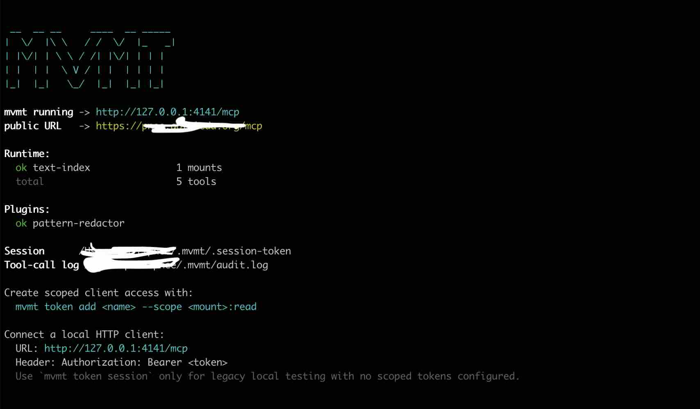

# mvmt

**A local-first MCP layer for scoped access to files, vaults, and tools.**

mvmt runs as a local MCP server between your data sources and your clients. You choose which folders, vaults, memory palaces, and tools are exposed, with read/write access controlled per source.

- **One server, every client** — Claude, Cursor, Codex, VS Code, and any MCP-compatible tool connect to a single local endpoint.
- **Read-only by default** — write access is opt-in per connector. Nothing writes unless you said so.
- **Scoped, not open** — choose exact folders, Obsidian vaults, and MemPalace paths. No full-disk access, no guessing.
- **Secure out of the box** — bearer-token auth, origin checks, environment scrubbing, audit log, and an optional pattern-based redactor for configured patterns.
- **Tunnel-ready** — expose mvmt to cloud clients like claude.ai over public HTTPS, with OAuth/PKCE for web clients.

> [!WARNING]
> Remote access is authenticated, but it still exposes your configured local tools beyond your machine. Keep connector scopes narrow before exposing mvmt over a tunnel.



## Quick Start

```bash
npm install -g mvmt
mvmt serve -i
```

On first run, `mvmt serve` walks you through folders, connectors, plugins, and local-only vs tunnel access, then starts mvmt in the foreground.

For a one-off read-only folder without touching your saved config:

```bash
mvmt serve --path ~/Documents -i
```

For source installs, connector setup, client tokens, and troubleshooting, see the [Setup Guide](docs/setup.md).

## Status

| Area | Status |
| --- | --- |
| Local filesystem folders | supported, read-only by default |
| Native Obsidian connector | supported, read-only by default |
| MemPalace connector setup | supported as stdio proxy, read-only by default |
| Local Streamable HTTP | supported |
| Stdio mode | supported |
| Interactive start mode | supported |
| Built-in pattern-based redactor plugin | supported, opt-in during `mvmt config setup` or first `mvmt serve` |
| Tunnel mode | supported for personal remote access; quick tunnel URLs are temporary |
| Managed remote relay / per-client remote access | not in v0 |
| HTTP proxy write gates | incomplete; advanced/manual config only |

## Client Compatibility

| Client | Transport | Status | Auth method | Known issues |
| --- | --- | --- | --- | --- |
| Claude Desktop | stdio | supported | process launch, no HTTP bearer token | Runs its own mvmt process per config |
| Claude Code | Streamable HTTP | supported | bearer token header | Refresh only after `mvmt token rotate` |
| Codex CLI | Streamable HTTP | supported | bearer token env var | Start Codex from a shell where the token env var is set |
| Cursor | Streamable HTTP | expected | bearer token header | Client behavior may vary by Cursor MCP version |
| VS Code / Copilot | Streamable HTTP | expected | bearer token header | Client behavior may vary by MCP extension/version |
| claude.ai / ChatGPT web | public HTTPS tunnel | supported remote mode | OAuth/PKCE over tunnel | Requires a public HTTPS URL; the client must either use dynamic client registration or have its exact `redirect_uri` pre-registered |
| Raw HTTP/curl | Streamable HTTP | debug only | bearer token header | Must follow MCP session initialization rules |

## Security At A Glance

Every file and data access in mvmt is gated. There is no open mode.

- HTTP mode binds to `127.0.0.1`, not `0.0.0.0`.
- HTTP requests to `/mcp` and `/health` require a bearer token.
- The bearer token is stored at `~/.mvmt/.session-token`, reused across restarts, and rotated explicitly with `mvmt token rotate`.
- Browser requests from non-localhost origins are rejected unless allowlisted.
- Write access is opt-in per connector.
- Stdio child processes receive a scrubbed environment.
- Optional pattern-based redactor can warn, redact, or block configured regex matches in tool results.
- Tool calls are appended to `~/.mvmt/audit.log`.

Not yet enforced: TLS on localhost, per-client tokens, rate limiting, and full write gates for HTTP proxy connectors.

## Project Docs

- [Setup guide](docs/setup.md)
- [Client setup](docs/client-setup.md)
- [Configuration](docs/configuration.md)
- [Connectors](docs/connectors.md)
- [Plugins](docs/plugins.md)
- [Remote access](docs/remote-access.md)
- [Audit log](docs/audit-log.md)
- [Troubleshooting](docs/troubleshooting.md)
- [Architecture](docs/architecture.md)
- [Security policy](SECURITY.md)
- [Security memo](docs/security-memo.md)
- [Personal memo](docs/personal-memo.md)
- [Contributing](CONTRIBUTING.md)
- [Changelog](CHANGELOG.md)

## Client Setup

Most MCP clients let you add servers through their settings UI. You need two things:

- **URL**: `http://127.0.0.1:4141/mcp`
- **Authorization header**: `Bearer <token from mvmt token>`

Claude Desktop is the exception — it uses stdio mode and launches mvmt directly, so no token is needed.

For remote web clients that use OAuth, mvmt also enforces redirect-URI registration. The client must either:

- register itself with mvmt through the OAuth `/register` endpoint, or
- use a pre-registered exact `redirect_uri`

If the client skips registration and sends an unknown `redirect_uri`, `/authorize` fails.

See [Client Setup](docs/client-setup.md) for step-by-step instructions for Claude Desktop, Claude Code, Codex CLI, Cursor, VS Code, and raw HTTP.

## Configuration

`mvmt config setup` writes `~/.mvmt/config.yaml`, and the first `mvmt serve` run creates it automatically if it does not exist yet. The config controls four things:

- **`server`** — port, allowed origins, and whether to start a tunnel for public access.
- **`proxy`** — external MCP servers that mvmt proxies (e.g. filesystem and MemPalace).
- **`obsidian`** — the native Obsidian vault connector.
- **`plugins`** — security plugins that inspect tool results before they reach clients (e.g. the pattern-based redactor).

You should not need to write this file by hand. To re-run setup, use `mvmt config setup`. To inspect it, run `mvmt config`. To validate it, run `mvmt doctor`.

See [Configuration](docs/configuration.md) for the full schema reference, field descriptions, and editing instructions.

## Commands

| Command | Description |
| --- | --- |
| `mvmt serve` | Configure mvmt if needed, then start the MCP server |
| `mvmt doctor` | Validate config and check connector health |
| `mvmt config` | Show the saved mvmt config |
| `mvmt config setup` | Run guided setup and save mvmt config |
| `mvmt token` | Show the current bearer token and age |
| `mvmt token rotate` | Generate a new bearer token and print it |
| `mvmt tunnel` | Show tunnel status |
| `mvmt tunnel config` | Choose a different tunnel and save it to config |
| `mvmt tunnel start` | Start the configured tunnel for the running mvmt process |
| `mvmt tunnel refresh` | Restart the configured tunnel and print the new URL |
| `mvmt tunnel stop` | Stop public tunnel exposure without stopping mvmt |
| `mvmt tunnel logs` | Show recent tunnel output |
| `mvmt tunnel logs stream` | Stream live tunnel output |
| `mvmt --version` | Print version and check for updates |

### `mvmt --version`

Prints the installed version and runs a best-effort npm update check.

```bash
mvmt --version
mvmt --version --no-update-check
```

Update checks never install anything. They are skipped when `MVMT_NO_UPDATE_CHECK=1` or `CI` is set. Notices are written to stderr so JSON stdout stays usable.

### `mvmt serve`

Starts the hub.

```bash
mvmt serve
mvmt serve -i
mvmt serve --path ~/Documents
mvmt serve --port 4142
mvmt serve --config ~/.mvmt/config.yaml
mvmt serve --stdio
```

Options:

| Flag | Description |
| --- | --- |
| `--port <n>` | Override `config.server.port` |
| `--config <p>` | Use a specific config file |
| `--path <dir>` | Temporarily expose a filesystem folder as read-only for this run only (repeatable) |
| `--stdio` | Serve MCP over stdio instead of HTTP |
| `--interactive`, `-i` | Start an interactive control prompt |
| `--verbose` | Print more startup details |

Behavior:

- If no saved config exists, `mvmt serve` runs guided setup first, saves config, then starts.
- If a saved config exists, `mvmt serve` starts immediately.
- `mvmt serve --path ...` uses a temporary read-only filesystem config for that run only and does not modify the saved config.

HTTP mode:

- Binds to `127.0.0.1`.
- Reuses the existing bearer token if one already exists.
- Writes the token to `~/.mvmt/.session-token` with mode `600`.
- Requires the token for `/mcp` and `/health`.

Stdio mode:

- Used by clients that launch mvmt directly.
- Does not use bearer-token auth because there is no HTTP listener.
- Skips update checks because stdout is reserved for MCP protocol messages.

Interactive mode:

- Run `mvmt serve -i`.
- Keeps mvmt in the foreground with a prompt at the bottom.
- Uses the same grouped commands as the top-level CLI for config, token, and tunnel operations.
- Live logs show connector, tool name, argument keys, duration, and error state without printing full argument values.

Interactive command shape:

```text
> config
> config setup

> token
> token rotate

> tunnel
> tunnel config
> tunnel start
> tunnel refresh
> tunnel stop
> tunnel logs
> tunnel logs stream

> logs
> logs on
> logs off
```

### `mvmt config`

Shows the saved mvmt config in a readable summary.

```bash
mvmt config
mvmt config --config ~/.mvmt/config.yaml
```

Use `mvmt config setup` to rerun guided setup and overwrite the saved config explicitly.

### `mvmt doctor`

Validates the local install, config, and enabled connectors.

```bash
mvmt doctor
mvmt doctor --json
mvmt doctor --config ~/.mvmt/config.yaml
mvmt doctor --timeout-ms 20000
```

Checks include:

- Package version and update availability.
- Config file existence.
- Config schema validation.
- Config file permissions.
- Server port and allowed origins.
- Enabled filesystem connector startup and tool listing.
- Enabled Obsidian connector startup and tool listing.

`mvmt doctor` exits with status `0` when config is valid and all enabled connectors are healthy. It exits with status `1` when config is missing, invalid, or any enabled connector fails health checks.

### `mvmt token` / `mvmt token rotate`

Manages the HTTP bearer token used by `/mcp` and `/health`.

```bash
mvmt token
mvmt token rotate
```

`mvmt token` prints the current token, age, and file path. `mvmt token rotate` writes a new token to `~/.mvmt/.session-token` and prints it. Running HTTP servers validate against the token file on each request, so rotation takes effect immediately. Any connected client that stored the old token must be updated, and existing OAuth access tokens are revoked immediately.

Normal `mvmt serve` restarts reuse the same root token. OAuth access tokens minted from that root token remain valid across restart until they expire or you rotate the token.

`mvmt token show` remains a hidden compatibility alias for raw token output.

### `mvmt tunnel`

Shows tunnel config and live runtime status.

```bash
mvmt tunnel
mvmt tunnel config
mvmt tunnel start
mvmt tunnel refresh
mvmt tunnel stop
mvmt tunnel logs
mvmt tunnel logs stream
```

`mvmt tunnel config` updates the saved tunnel config and, if mvmt is already running, applies it immediately. `mvmt tunnel logs` prints recent buffered tunnel output. `mvmt tunnel logs stream` follows live tunnel output from the running mvmt process.

## Connectors

A connector is the code that gives mvmt access to one local data source or tool surface. It owns discovery, permissions, tool definitions, tool execution, and cleanup for that source.

mvmt currently supports three connector setups. All are read-only by default with opt-in write access.

**Obsidian** — native connector that reads markdown files directly from a vault. Tools: `search_notes`, `read_note`, `list_notes`, `list_tags`, and `append_to_daily` (write, opt-in). Path traversal is blocked; symlinks are skipped.

**Filesystem** — proxies the official `@modelcontextprotocol/server-filesystem` MCP server as a stdio child process. When `writeAccess: false`, mvmt hides write tools from `listTools` and rejects them at `callTool`.

**MemPalace** — proxies the local MemPalace MCP server as a stdio child process. Guided setup tries to detect your `mempalace` command and palace path. When `writeAccess: false`, mvmt hides known MemPalace write tools such as drawer creation, tunnel deletion, KG mutation, hook settings, and diary writes.

Tools from all connectors are prefixed with the connector ID (e.g. `obsidian__search_notes`, `proxy_filesystem__read_file`, `proxy_mempalace__mempalace_search`) to avoid name collisions.

To add a native connector in v0, implement the `Connector` interface, add config schema for its scope, wire it into startup, and add tests for path/scope/write behavior. See [Connectors](docs/connectors.md) for the implementation checklist.

## Plugins

A plugin is a post-processing hook that runs after a connector returns a tool result and before that result is sent back to the MCP client. Plugins can inspect, annotate, transform, or block outbound tool results.

The built-in `pattern-redactor` plugin scans text tool results with regex patterns and can `warn`, `redact`, or `block` matches. Default patterns cover common API keys (OpenAI, Anthropic, AWS, GitHub, Slack) and JWT-looking strings.

> [!WARNING]
> This is a best-effort pattern matcher, not a security control. If data must not reach AI tools, scope the connector to exclude it.

To add a plugin in v0, implement the `ToolResultPlugin` interface, add config schema, register it in the plugin factory, and make audit events explicit when it changes output. See [Plugins](docs/plugins.md) for the implementation checklist.

## Security Model

Every file and data access in mvmt is gated. There is no open mode.

- **Localhost bind** — HTTP listens on `127.0.0.1` only.
- **Bearer token** — 256-bit, stored at `~/.mvmt/.session-token`, reused across restart, constant-time validation, rotatable without restart.
- **Origin allowlist** — browser requests from non-localhost origins are rejected unless explicitly allowed.
- **Environment scrubbing** — stdio child processes receive only an allowlist of env vars.
- **Write gates** — read-only by default per connector; write tools are hidden and rejected unless enabled.
- **Pattern redactor** — opt-in regex scrubbing of tool results before they reach clients.
- **Audit log** — every tool call appended to `~/.mvmt/audit.log` as JSONL with mode `600`.

Not yet enforced: TLS on localhost, per-client connector scoping, and write gates for HTTP proxy connectors.

See [Security Memo](docs/security-memo.md) for design notes and [Audit Log](docs/audit-log.md) for log format and queries.

## Remote Access

mvmt is local-first. Cloud clients like claude.ai cannot reach `127.0.0.1` directly. `mvmt config setup` and `mvmt tunnel config` can configure a tunnel that gives you a public HTTPS URL.

Quick tunnels are temporary, which means you lose the URL when mvmt is shut down. Use a named tunnel or reserved domain to keep the same URL.

Recommended quick tunnel: Cloudflare. For stable hostnames such as `pnee.example.com`, use a Cloudflare named tunnel; `mvmt tunnel config` and interactive `tunnel config` can save that custom command and public URL.

> [!WARNING]
> Remote web clients authorize with OAuth/PKCE. Direct HTTP clients use bearer tokens. Auth controls who connects; connector scope controls what they can access.

> [!IMPORTANT]
> mvmt only redirects OAuth authorization codes to registered callback URLs. If your web MCP client does not support RFC 7591 dynamic client registration, you must pre-register its exact `redirect_uri` before testing the flow.

Remote access checklist:

- Use Cloudflare Tunnel when possible.
- Expose the smallest useful folder, vault, or connector scope.
- Keep write access disabled unless you explicitly need it.
- Do not expose secrets, credential folders, home directories, production databases, or browser profiles.
- Watch the audit log when using remote clients.
- Stop the tunnel when you are done with remote access.

See [Remote Access](docs/remote-access.md) for tunnel providers, runtime management, and safety guidelines.

## Troubleshooting

See [Troubleshooting](docs/troubleshooting.md) for common issues: port conflicts, connector failures, missing tools, vault detection, and token rejection.

## Coming Next

Planned work is focused on safer long-running use and better local data coverage:

- Fast file indexer with Chroma's embedded JS/TS version.
- Full key management: named keys, rotation, revocation, expiration.
- Per-client permissions and connector scoping.
- Runtime permission changes for folders, vaults, and connector write access.
- Remote access hardening guides for Cloudflare Named Tunnels, Cloudflare Access, and rate limiting.
- SQLite connector with per-table read/write permissions.
- Atomic writes and optional `--preview` mode.
- Git connector for local history, diffs, blame, and branch-aware search.

## Contributing

Contributions are welcome while the project is early. Keep changes focused and security-conscious. Read [CONTRIBUTING.md](CONTRIBUTING.md) and report vulnerabilities through [SECURITY.md](SECURITY.md).

## License

MIT
